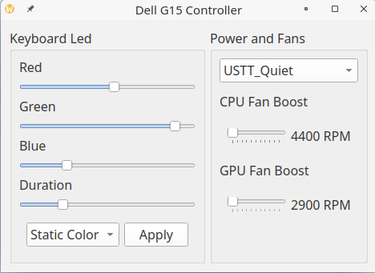

# Dell-G-Series-Controller
A simple GUI app written in PyQt to control keyboard backlight, power mode and fan speed on some Dell G15 and Alienware Laptops. Untested on any other laptop, but keyboard part can most likely be used with models that have the ```Bus *** Device ***: ID 187c:0550 Alienware Corporation LED controller```. Power related functions are specific to the laptop models below, but might work on similar models.

| Laptop Model     |    Power Settings    | Keyboard Backlight |
|------------------| -------------------- |--------------------|
| G15 5530         |  :white_check_mark:  | :grey_question:    |
| G15 5525         |  :white_check_mark:  | :white_check_mark: |
| G15 5520         |  :white_check_mark:  | :white_check_mark: |
| G15 5511         |  :white_check_mark:  | :white_check_mark: |
| G16 7620         |  :white_check_mark:  | :white_check_mark: |
| G16 7630         |  :white_check_mark:  | :white_check_mark: |
| Alienware M16 R1 |  :white_check_mark:  | :grey_question:    |


By default, leds will flash red on low battery, and have half brightness on battery.

Only static color and morph is supported at this time. 
 
**Use at your own risk.**

## Dependencies
- Polkit
- Pyside6
- Udev
- Acpi_call

## Installation

Create an udev rule ```/etc/udev/rules.d/00-aw-elc.rules```.

```
/etc/udev/rules.d/00-aw-elc.rules

SUBSYSTEM=="usb", ATTRS{idVendor}=="187c", ATTRS{idProduct}=="0550", MODE="0660", TAG+="uaccess", SYMLINK+="awelc"
```

Polkit is required for power and fan related functionality. If it is not already loaded, load the acpi_call module before launching this application.
```
modprobe acpi_call
```


### Arch Linux
You can install [from the AUR](https://aur.archlinux.org/packages/dell-g15-controller) if on Arch Linux. For dependencies, see the AUR link.

### Other distros
Install the dependencies, as well as `libxcb-cursor0` if required.

### NixOS
Use the Nix-packaged PySide6 (pip wheels + `LD_LIBRARY_PATH` hacks often **segfault**):

```bash
./run-nixos.sh check    # quick import test
./run-nixos.sh doctor   # acpi_call, polkit, pkexec, NoNewPrivs, USB (recommended before first run)
./run-nixos.sh run
```

This uses `shell.nix` (`python313` + `pyside6` from nixpkgs). The `.venv/` from older instructions is no longer required for `run-nixos.sh`.

**`dell-g-controller-launch`:** the repo file `dell-g-controller-launch` runs `run-nixos.sh`; symlink it to `~/.local/bin` if you are not on the NixOS `configuration.nix` that installs the same name into the system profile.

**Super+F9 (iNiR):** the default Niri keybind spawns `dell-g-controller-launch` (PATH must include `/run/current-system/sw/bin` — iNiR’s `40-environment` does that on NixOS).

**“No root access” / power tab missing:** power features need **`pkexec`** + a **polkit GUI agent**. On NixOS, rebuild with **`programs.inir.enablePolkit = true`** (or `security.polkit.enable` + a user service for `polkit-gnome-authentication-agent-1`), then re-login. Approve the polkit prompt when the app starts. Run from **Foot/Kitty**, not a stripped environment (e.g. some IDE terminals), so the auth dialog can appear. Load **`acpi_call`**: `sudo modprobe acpi_call` (your config should list it in `boot.kernelModules` — iNiR `dellGSeries` does).


## Usage
```
python main.py
```
- For keyboard backlight, choose red, green and blue levels, choose a mode , and press apply. Press the system tray icon to enable/disable keyboard backlight quickly.
- To remove the animation, choose "Off" in keyboard backlight mode. After this, AWCC can be used from Windows.
- For power control, choose a power mode first. Afterwards, fan boost levels can optionally be set. Fan rpm and temperatures are polled every second.

## Screenshots


## License
GNU GENERAL PUBLIC LICENSE v3

## Contributions
Written using the information and code from https://github.com/trackmastersteve/alienfx/issues/41. 

Many thanks to @AlexIII and @T-Troll for their help with the ACPI calls.

